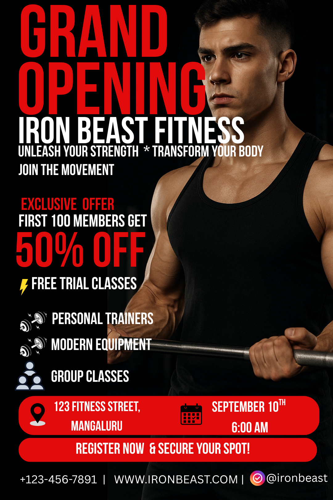

# print-design-sample
# Iron Beast Fitness Flyer

## 📌 Project Overview
This is a sample print design project for **Iron Beast Fitness**.  
It is a flyer created to promote the **Grand Opening** event.

The design showcases:
- Bold typography for impact  
- Eye-catching promotional highlights  
- Clear event details  

## 📂 Files Included
- `assets/ironbeast-flyer-web.png` — Web preview (compressed for fast loading)  
- `assets/ironbeast-flyer-print.pdf` — Print-ready file (300 DPI, CMYK, bleed included)  
- `source/` — Original design source files (AI/PSD) 

## 🖨️ Print Specifications
- Resolution: 300 DPI  
- Color mode: CMYK  
- Bleed: 3mm  
- Format: PDF/X-4 (print-ready)  

## 🌐 Web Version
- Optimized PNG/JPG for web sharing  
- sRGB color profile  
- File size reduced for quick loading  

## 📜 License
This project is shared for **portfolio/demo purposes**.  
If you reuse or adapt this flyer, please give credit.  
You may choose a license that fits your needs (MIT, CC BY-NC 4.0, etc.).

---

✍️ Created by shraddha 
📧 Contact: thinkneuofficial@gmail.com
